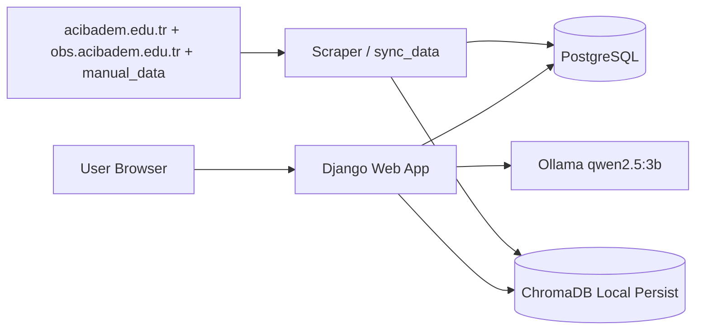

# Acibadem University Academic Assistant

## Course Information

- Course: `CSE 322 Cloud Computing`
- Project: `ACU AI Chatbot`
- Submission format: This Markdown file is a draft that can be exported to `report.pdf`.

## Team Members

- `[Name Surname]` - `[Student ID]` - `[Role]`
- `[Name Surname]` - `[Student ID]` - `[Role]`
- `[Name Surname]` - `[Student ID]` - `[Role]`

## 1. Introduction

This project is an AI-powered academic assistant for Acibadem University. The application answers user questions by combining a Django web application, a PostgreSQL database, a local large language model running through Ollama, and a retrieval-augmented generation (RAG) pipeline.

The main goal of the project is to provide a chatbot that can answer university-related questions without calling any external commercial AI API. All inference is performed locally. The project is packaged with Docker Compose and can be started with a single command.

## 2. Architecture

The system uses three main services:

1. `webapp`: Django application, chat UI, REST API, admin panel, scraping command, and local ChromaDB usage.
2. `db`: PostgreSQL for structured content and chat history.
3. `llm-service`: Ollama container serving the `qwen2.5:3b` model.

### Architecture Diagram



### Data Flow

1. The user sends a question from the web UI or the JSON API.
2. Django retrieves relevant context from ChromaDB and PostgreSQL-backed content.
3. The prompt is assembled with system instructions and retrieved evidence.
4. The question is sent to Ollama running the local model.
5. The answer is post-processed, validated, and returned with source information.
6. The chat log is stored in PostgreSQL and shown in the sidebar history.

## 3. Implementation Details

### 3.1 Web Application

The web interface is built with Django and provides:

- A chat interface for user questions and answers
- A sidebar showing previous conversations
- A `Yeni Sohbet` action for starting a new conversation
- A REST endpoint at `POST /api/chat/`
- A Django admin panel for content and chat inspection
- A health endpoint at `/health/`

The chat history is stored in PostgreSQL and grouped by session key. The sidebar displays previous conversations using the first user message as the conversation title.

### 3.2 Data Collection

The project includes a `webapp/scraper/` module. The main synchronization logic lives in `webapp/scraper/sync_data.py` and is exposed through the Django command `python manage.py sync_data`.

Current data sources:

- Web scraping from `acibadem.edu.tr`
- Public Bologna scraping from `obs.acibadem.edu.tr`
- Extra high-priority URLs for admissions and program pages
- Manual text files under `webapp/scraper/manual_data/`

During synchronization, cleaned content is stored in PostgreSQL and indexed into ChromaDB. The current OBS/Bologna pipeline discovers public undergraduate program pages from the public unit selection page and indexes program overview and course-plan content.

### 3.3 AI Integration

The selected model is `qwen2.5:3b` served with Ollama. This model was chosen because it offers stronger answer quality than smaller variants while still remaining practical for local use in the assignment environment.

The AI layer includes:

- Prompt engineering through a system prompt builder
- Retrieval-augmented generation using ChromaDB
- Manual source prioritization for important departments
- Deterministic direct answers for high-priority quota questions
- Response cleaning and low-quality output filtering

This means the project goes beyond simply calling a model and includes custom grounding logic tailored to the assignment.

## 4. Docker Setup

The application is packaged with Docker Compose and can be started using:

```bash
docker compose up -d --build
```

At startup:

- PostgreSQL is initialized
- Ollama starts and checks whether `qwen2.5:3b` is already available
- Django migrations are applied
- The web application checks if university data exists
- The server starts at `http://localhost:8000/`

This setup satisfies the assignment requirement that the system should be startable from a single Compose command.

## 5. Folder Structure

The source tree was reorganized to follow the structure suggested in the assignment PDF:

```text
.
├── docker-compose.yml
├── .env.example
├── README.md
├── webapp/
│   ├── Dockerfile
│   ├── requirements.txt
│   ├── manage.py
│   ├── config/
│   ├── chat/
│   ├── scraper/
│   ├── static/
│   └── templates/
└── docs/
```

## 6. Evaluation

We tested the chatbot with 10 sample questions. The detailed results are listed in `evaluation.md`.

### Evaluation Summary

- Fully correct answers: `5 / 10`
- Safe fallback / incomplete answers: `4 / 10`
- Incorrect / unsupported inference answers: `1 / 10`

The strongest results were observed on manually curated quota questions. After switching to the 3B model, at least one broad factual question improved, but the weakest area is still policy and student-life knowledge where the current dataset is incomplete.

## 7. Challenges

### 7.1 Noisy University Web Pages

University pages include navigation menus, repeated layout elements, and mixed content blocks. The scraper had to remove this noise before indexing the text.

### 7.2 Turkish Query Matching

Turkish character normalization and department keyword matching required extra handling so that the retrieval layer could better recognize user intent.

### 7.3 Limited Coverage

The project currently performs best on curated data. Generic student-life and policy questions still need more sources, but the system now also pulls public OBS/Bologna academic content to improve program and curriculum coverage.

### 7.4 Hallucination Control

Although fallback rules reduce many bad outputs, one unsupported inference was still observed in the evaluation set. This shows that stricter grounding and more source coverage are still needed.

## 8. Team Contributions

Fill this section with the actual contribution split before final submission.

- `[Member 1]`: Django backend, database models, admin panel
- `[Member 2]`: RAG pipeline, Ollama integration, prompt engineering
- `[Member 3]`: Frontend UI, sidebar chat history, testing, documentation

## 9. Conclusion

The project successfully delivers a Dockerized local university chatbot using Django, PostgreSQL, Ollama, and RAG. It satisfies the main technical requirements of the assignment and demonstrates meaningful AI customization through prompt engineering, retrieval, response filtering, and deterministic answer logic.

The main remaining improvements are broader data coverage across more public pages, a polished final PDF export, and stronger handling for generic factual questions.
